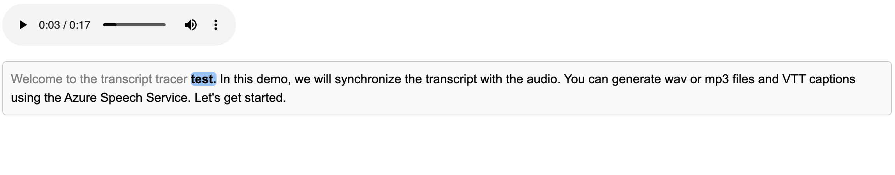

# Transcript Tracer

Transcript Tracer is a tool that synchronizes text transcripts with audio or video content using WebVTT (VTT) files. By linking the transcript to specific timestamps, it allows users to follow along with the media playback and highlights the corresponding transcript text. This tool is designed to enhance accessibility and user engagement.

## Features

- **Transcript and Media Synchronization**: Automatically syncs text transcripts with audio or video playback.
- **Customizable Options**: Offers configuration options for clickability, auto-scrolling, and time offset.
- **WebVTT Support**: Supports VTT files for captioning and synchronization.
- **Interactive Transcripts**: Users can click on any part of the transcript to jump to the corresponding audio or video segment.

## Demo - (Custom styled)

<video width="560" height="100%" controls>
  <source src="https://raw.githubusercontent.com/Dinuda/transcript-tracer/master/src/assets/demo-f.mp4" type="video/mp4">
  Your browser does not support the video tag.
</video>

## Demo raw



## Installation

You can install Transcript Tracer using npm:

```bash
npm install transcript-tracer
```

## Usage

Here’s a simple example to get you started:

### 1. HTML Setup

Include an audio or video element with a WebVTT file:

```html
<audio
  src="https://raw.githubusercontent.com/Dinuda/transcript-tracer/master/src/assets/test.wav"
  controls
>
  <track
    kind="metadata"
    src="https://raw.githubusercontent.com/Dinuda/transcript-tracer/master/src/assets/test.vtt"
  />
</audio>

<div
  class="tt-transcript"
  data-tt-media-urls="https://raw.githubusercontent.com/Dinuda/transcript-tracer/master/src/assets/test.wav"
>
  Welcome to the transcript tracer test. In this demo, we will synchronize the
  transcript with the audio. You can generate wav or mp3 files and VTT captions
  using the Azure Speech Service. Let's get started.
</div>
```

### 2. Initialize Transcript Tracer in JavaScript

```js
import { loadTranscriptTracer } from "transcript-tracer";

// Fetch the transcript and initialize
fetch(
  "https://raw.githubusercontent.com/Dinuda/transcript-tracer/master/src/assets/test.vtt"
)
  .then(
    (response) => response.text() // Get the transcript as text
  )
  .then((transcript) => {
    // Once the transcript is fetched, initialize the TranscriptTracer
    TranscriptTracer.loadTranscriptTracer({}, transcript);
  })
  .catch((error) => console.error("Error loading the transcript:", error));
```

You can also use `cleanupTranscriptTracer()` to reset the state when needed.

## Configuration Options

Transcript Tracer provides several configuration options for customization:

| **Option**           | **Type**  | **Description**                                                                 |
| -------------------- | --------- | ------------------------------------------------------------------------------- |
| `blockSelector`      | `string`  | CSS selector for block elements within the transcript.                          |
| `phraseSelector`     | `string`  | CSS selector for phrase elements within the transcript.                         |
| `alignmentFuzziness` | `number`  | Amount of fuzziness allowed when aligning words with timings (default: 0).      |
| `timeOffset`         | `number`  | Time offset to adjust the current time of the media player (default: 0).        |
| `autoScroll`         | `string`  | Determines the scroll behavior: 'block', 'phrase', or 'word' (default: null).   |
| `clickable`          | `boolean` | Whether words should be clickable to jump to their start time (default: false). |

### Example with Options:

```js
loadTranscriptTracer(
  {
    ttClickable: true,
    ttAutoScroll: "word", // Auto-scroll by 'block', 'phrase', or 'word'
    ttTimeOffset: 0.5, // Adjust timing offset in seconds
  },
  transcript
);
```

## Styling

You can customize the look and feel of the transcript using CSS. Here’s an example of some basic styles:

```css
.tt-transcript {
  font-family: Arial, sans-serif;
  font-size: 16px;
  line-height: 1.5;
}

.tt-word {
  cursor: pointer;
  background-color: transparent;
  transition: background-color 0.3s ease;
}

.tt-word:hover {
  background-color: #f0f0f0;
}

.tt-current-word {
  background-color: #ffeb3b;
}

.tt-previous-word {
  color: gray;
}

.tt-current-block-container,
.tt-current-phrase-container {
  background-color: rgba(255, 235, 59, 0.3);
}
```

Feel free to modify the styles to fit your project’s design.

## Roadmap

- React docs
- Add support for subtitles with multiple languages.
- Integration with popular video platforms.
- Improved performance and scalability for larger transcripts.
- Browser extensions for easier integration with websites.

## License

This project is licensed under the MIT License - see the [LICENSE](LICENSE) file for details.
